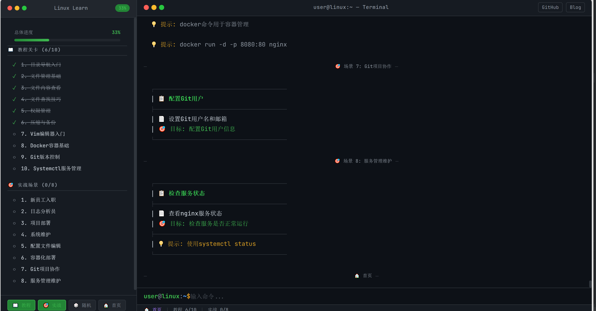

# Linux 命令学习系统

一个交互式的 Linux 命令学习平台，通过模拟终端环境帮助初学者学习 Linux 命令。

**在线演示**: [linux.rongx.top](https://linux.rongx.top)



## 这是什么？

这是一个基于 Web 的 Linux 命令学习工具，主要特点：

- 模拟真实的 Linux 终端环境
- 提供教程模式和实战模式两种学习方式
- 支持命令验证和智能提示
- 自动保存学习进度

适合操作系统课程学习或 Linux 入门训练。

## 功能介绍

### 教程模式

按关卡系统学习，从基础到进阶：

1. 目录导航入门 - cd、pwd、ls
2. 文件管理基础 - touch、mkdir、cp、mv、rm
3. 文件内容查看 - cat、more、less、head、tail
4. 文件搜索与查找 - find、whereis、grep
5. 权限管理 - chmod
6. 压缩与解压 - tar、gzip、bzip2
7. Vim 编辑器基础

   <br />

### 实战模式

在模拟的真实场景中练习命令，将所学应用到实际任务中。

### 核心特性

- **命令验证**: 实时检查命令是否正确
- **智能提示**: 错误次数越多提示越详细
- **文件系统模拟**: 完整的 Linux 文件结构
- **进度保存**: 自动保存，支持断点续学
- **随机挑战**: 随机选择关卡练习

## 如何使用

### 在线访问

直接打开 [linux.rongx.top](https://linux.rongx.top) 即可使用。

### 本地运行

```bash
# 克隆项目
git clone https://github.com/RONGX563647/LINUX-LEARN-SHOW.git
cd LINUX-LEARN-SHOW

# 启动本地服务器（任选一种）
python -m http.server 8080
# 或
npx http-server -p 8080

# 浏览器访问
# http://localhost:8080/show/
```

## 支持的命令

目前支持以下常用 Linux 命令：

**目录操作**: pwd, cd, ls

**文件管理**: touch, mkdir, cp, mv, rm, rmdir

**文件查看**: cat, more, less, head, tail

**搜索查找**: find, whereis, grep

**权限管理**: chmod

**压缩解压**: tar, gzip, bzip2

**编辑器**: vim（基础操作）

## 项目结构

```
show/
├── index.html          # 主页面
├── tutorial.html       # 教程模式
├── practice.html       # 实战模式
├── css/style.css       # 样式
└── js/
    ├── app.js          # 主逻辑
    ├── terminal.js     # 终端模拟
    ├── commands.js     # 命令处理
    ├── validator.js    # 命令验证
    └── scenarios.js    # 关卡数据
```

## 快捷命令

在终端中可以使用：

- `t` 或 `tutorial` - 进入教程
- `p` 或 `practice` - 进入实战
- `b` 或 `home` - 返回首页
- `r` 或 `random` - 随机挑战
- `list` - 列出所有关卡
- `goto <编号>` - 跳转关卡
- `h` 或 `hint` - 显示提示
- `skip` - 跳过当前任务
- `reset` - 重置进度
- `help` - 查看帮助

## 技术栈

- 原生 JavaScript (ES6+)
- CSS3
- localStorage（进度保存）

## 开发背景

这个项目最初是为了操作系统课程的 Linux 命令学习而开发，目的是提供一个可以在线练习 Linux 命令的环境，不需要安装虚拟机或远程连接服务器。

## 反馈与贡献

如果遇到问题或有建议，欢迎：

- [提交 Issue](https://github.com/RONGX563647/LINUX-LEARN-SHOW/issues)
- 提交 Pull Request

## 相关链接

- [项目仓库](https://github.com/RONGX563647/LINUX-LEARN-SHOW)
- [在线演示](https://linux.rongx.top)
- [个人博客](https://www.rongx.top)

***

如果觉得有用，欢迎 Star ⭐
